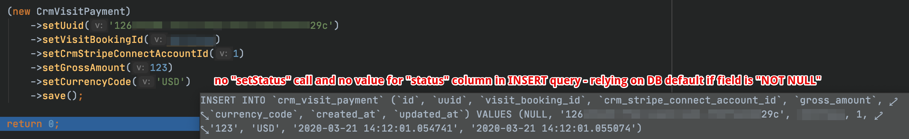
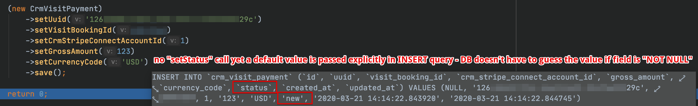

# inserts-always-include-default-values-behavior

Propel behavior for always including columns that have default values in INSERT queries.

### SQL query before

### SQL query after

### Example diff produced

